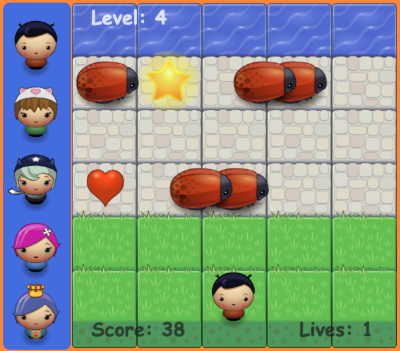

# Classic Arcade Game (Frogger)
Browser-based arcade game (also known as Frogger)
Implemented using ES6 (classes).

## How to play.
1. Using the mouse choose your character's image.
2. Using the keyboard arrows (up, right, down, left), move your character.
3. The main goal is to get the highest score possible.
4. The player's score is increased by crossing your character from the grass area to the water area or by collecting as many stars as possible, avoiding getting killed. The player will get killed if it collides with the enemy bugs.
5. Score will be increased by 10 points if your character crosses to the water area (in other words, if you clear a level).
6. Score will be increased by 2 points if your character collects a star.
7. One live will be deducted if your character collides against an enemy/bug.
8. One live will be added if your character collects a heart. Hearts are made available randomly when the player is running low on lives.
9. The game will start in an easy mode (there will be fewer enemy bugs and they will go slower), but the difficulty level will increase as you clear more levels (more bugs will move faster).

## Issues.

- Since I do not have a deeper knowledge of how a canvas works, I was not able to implement the different features provided, like the player's image selection, or the modal banner congratulating for passing a level, in the canvas environment.
- For the same reason previously mentioned, I was not able to pause and display a crash character when the player collides with a bug.
- Even though a random initial position is assigned to the enemies (bugs) in order to avoid patterns, this does not prevent the game from having clusters of bugs which leaves empty columns for the player to cross easily.
- Since I am used to code using structured programing, it is a somehow confusing to determine how to represent some data with Objects.

## Future Improvements.
- Implement keyboard accessibility in order to let the player pick the character's image.
- Implement a _Settings_ option:
  * Add the option to set a level countdown timer.
  * Let the user pause the game.
  * Add a reset button.
- Improve the way the enemies (bugs) are spaced/placed. Even though I did some adjustments on the range of the initial position and the number of enemies (bugs), there are still sometimes clusters of bugs.
- Implement a Score Panel: Allow users to input their names and record their scores and display a panel with those result ordered from best to ..... not so good.
- ~~Finishing implementing a Game Over modal popup window~~.

## Specifications met
1. Error free
  1.1 Player cannot move offscreen.
  1.2 Vehicles cross the screen.
  1.3 Vehicle-player collision happens logically.
  1.4 Vehicle-player collision resets the game.
  1.5 Something happens when the player wins.
2. Game Objects (player and vehicles) were implemented using JavaScript object-oriented programming features.
3. Collectible items on screen (stars for points and hearts for lives).
4. Player image selection
5. Modal Popup congratulating on passing a level.
6. Modal Popup indicating that the game is over. Also includes information about achieved score and levels passed.
7. Styling
10. Comments
11. README
# Arcade-Game-Frogger
